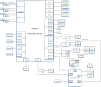

# Altra

My particular unit definitely has the AST2500 connected to the X550 and I210
over NSCI (The BOM optiona line).

I have it hooked only on the X550 port and both the main machine and the BMC
gets an IP address from my router.

## Configuration

* `M2_1` is hooked up to a `WD Black SN850X 2TB`
* `TPM` is hooked up to an [`ASROCK TPM-SPI`](https://asrock.com/mb/spec/product.asp?Model=TPM-SPI) which is a NPCT75x
`
* `USB3 Header` is connected to front panel

## Quirks

The Aptio firmware seems to be highly non-compliant with the UEFI spec for TPM measurements.
We are thinking of flashing EDK-II firmware to fix this.
